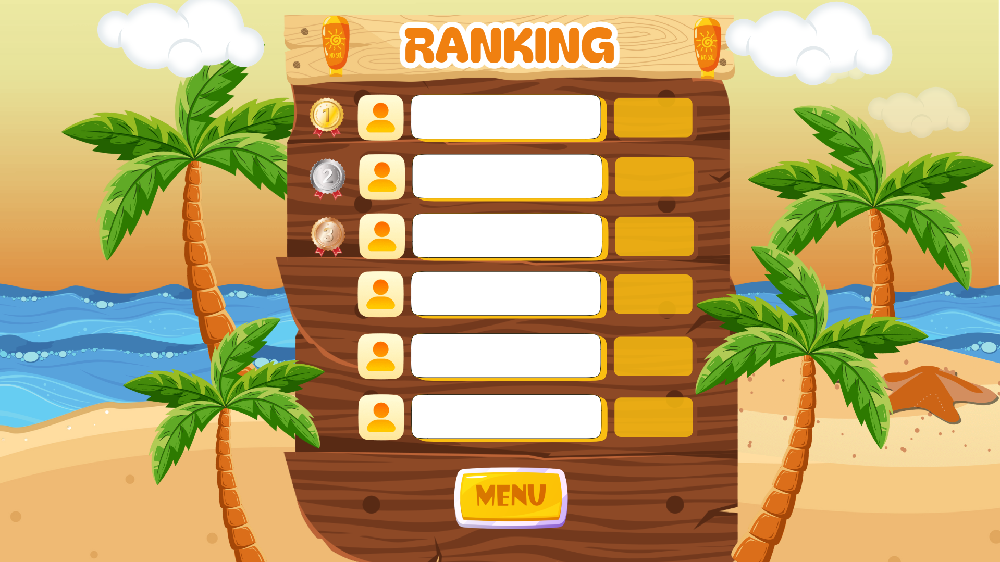

# Burn-Fight
### Advergame promocional desarrollado en Unity

> Burn-Fight es un videojuego arcade corto y dinámico creado como proyecto académico para promocionar una marca de protector solar.  
> El juego combina entretenimiento, interacción táctil y marketing experiencial, diseñado para ejecutarse en stands físicos durante eventos y atraer al público mediante una experiencia divertida y competitiva.

---

## Contexto

**Piñita**, una piña aventurera, llega a la playa lista para relajarse.  
Pero el **Malvado Sol**, con sus intensos rayos UV, intenta rostizarla.

Por suerte, Piñita cuenta con su arma secreta: **NOSOL**, un bloqueador solar que dispara ráfagas refrescantes mientras esquiva los ataques solares.

¿Lograrás vencer al Sol y conseguir la puntuación más alta?

---

## Características

-  Sistema de puntuación por daño al enemigo
-  Enemigo con múltiples patrones de ataque
-  Alertas visuales para ataques imparables
-  Mecánica de protección con bloqueador solar (NOSOL)
-  Optimizado para pantallas táctiles
-  Ranking de jugadores con almacenamiento en JSON
-  Gameplay rápido, accesible y competitivo

---

##  Objetivo del proyecto

Este proyecto fue desarrollado como un **advergame (videojuego publicitario)** con fines de marketing interactivo, pensado para:

- Atraer público en eventos presenciales
- Generar recordación de marca
- Incentivar la participación mediante competencia de puntajes
- Promocionar el uso del protector solar de forma lúdica

---

## Tecnologías utilizadas

- **Unity**
- **C#**
- **Sistema 2D (físicas y colisiones)**
- **Persistencia de datos con JSON**
- **UI/UX táctil**

---

## Mecánicas de juego

- Entre más daño causes al Sol, más puntos obtienes  
- Esquiva los distintos ataques del enemigo  
- Cuando la pantalla se ponga roja, prepárate para ataques imparables  
- Usa NOSOL para protegerte  
- Resiste el mayor tiempo posible  
- Consigue la puntuación más alta del día  

---

## Capturas

_Agrega aquí imágenes del gameplay_

---

